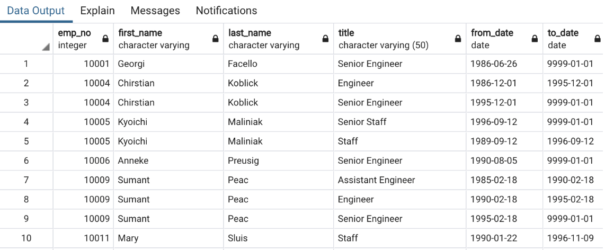
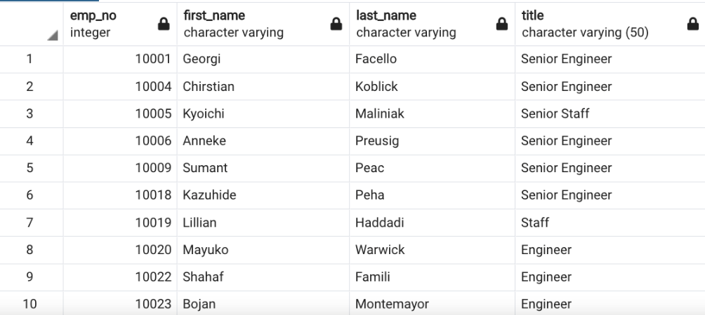
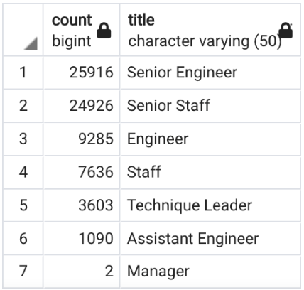
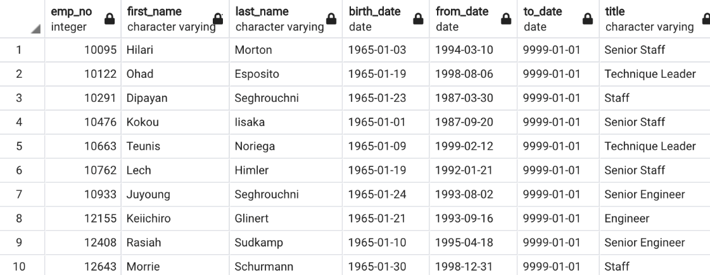

# Pewlett-Hackard-Analysis
## Overview/Purpose

The intent of this analysis was to import CSV files into database tables, compare and join datasets from multiple different sources to compile comprehensive lists of the number of retiring employees as well as the number of employees eligible for the mentorship program. The end goal would be to provide a summary of the analysis to mitigate the massive retirement of a particular age of employees, referred to as the 'silver tsunami'.

## Results

Using multiple tables, we were able to create a comprehensive database with inner joins between the tables using primary and foreign keys to come up with the most accurate analysis. We started by joining the employees table with the titles table with the constraint that we solely wanted to view results for employees who were born between 1952 through 1955. 
pics 

In reviewing the data more closely, we determined that the job titles were inconsitent, so in order to accurately report the titles without duplicates we used a 'select distinct' function within our query. 
pics 

After cleaning the title data, we were then able to obtain an accurate count of people retiring from each title/role. 
pics 

Once we'd quantified the number of potential retirees, it was important to then evaluate the individuals who would be eligible for the mentorship program to help fill some of the spots that will open up during the 'silver tsunami'. Eligible candidates are born within the year 1965, making the selection pool significantly smaller than the retiree age pool which spanned three years. 
pics 

## Summary
As the 'silver tsunami' begins to make an impact over 70,000 (72,458 to be exact) will need to be filled. If we restrict the criteria solely to those born in 1965, there are only about 1,500 (1,549 to be exact) eligible mentors. The impact of the 'silver tsunami' on the higher level, skilled positions such as Senior Staff & Senior Engineers where there are the greatest number of potential retirees is astronomical in comparison to the number of eligible mentors for those same job titles/roles. The company needs to come up with a structured game plan ASAP to mitigate that loss of staff. In order to better organize, I think it would be pertinent to dig deeper into the data to categorize and group at potentially different levels. For example, since the eligible mentors for the job title of "Technique Leader" is so small (77) in comparison to the potential retirees (3,603), it might be better to split mentorship into different categories such as overall Department, or even form groups of mentees that would rotate among the small amount of available mentors. I do think expanding the pool of mentors to include additional staff that is not necessarily of 'retirement age' would be beneficial as well. It could be that a newer fresh insight on the position by someone who is not ready to retire would lead to greater understanding and training into the roles. 
